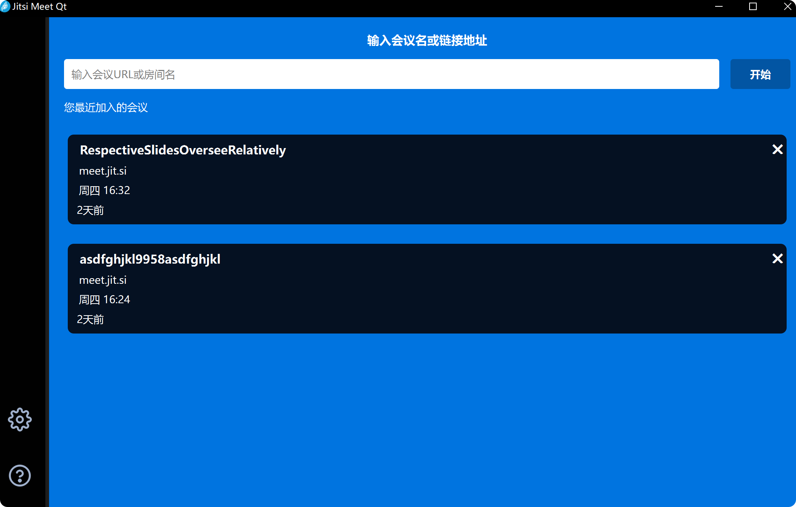
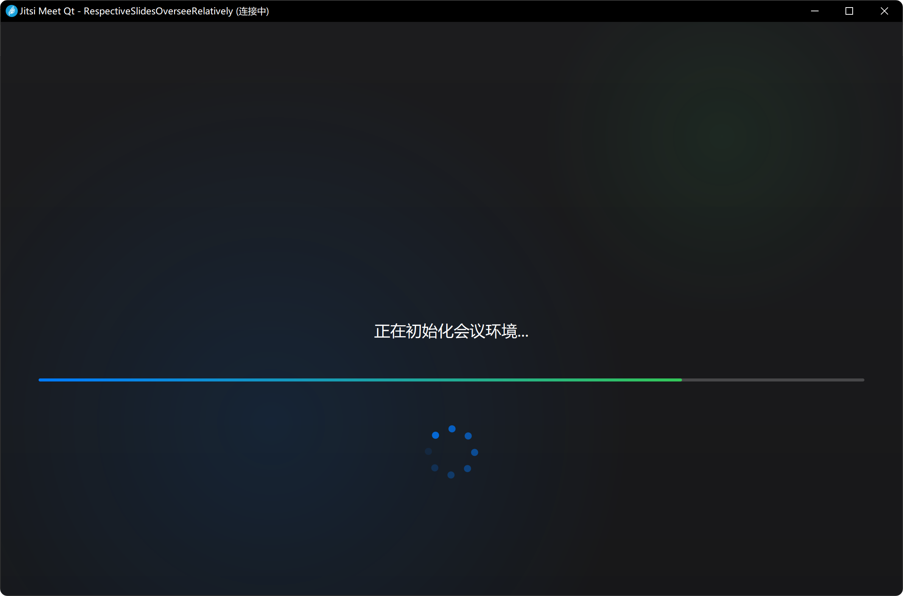
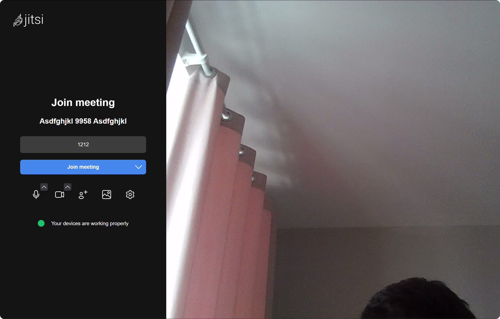
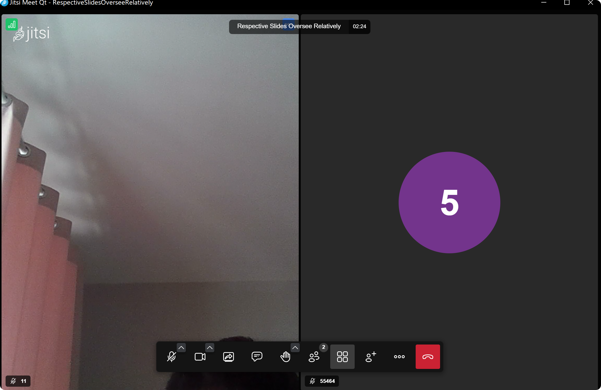

# Jitsi Meet Qt

Qt版本的Jitsi Meet桌面应用程序!









## 功能特性

- 🎥 完整的Jitsi Meet视频会议功能
- 🖥️ 原生Qt界面，更好的性能和用户体验
- 🔗 支持深度链接协议 (`jitsi-meet://`)
- 📝 最近会议历史记录
- ⚙️ 可配置的服务器设置
- 🌍 多语言支持
- 🎨 深色/浅色主题支持
- 💾 窗口状态记忆功能

## 系统要求

- Windows 10 或更高版本
- Qt 5.15.2 或更高版本
- MinGW 编译器
- 支持WebEngine的系统

## 构建说明

### 使用CMake

```bash
mkdir build
cd build
cmake ..
cmake --build .
```

### 使用qmake

```bash
qmake jitsi-meet-qt.pro
make
```

## 项目结构

```
jitsi-meet-qt/
├── src/                    # 源代码
│   ├── main.cpp           # 程序入口
│   ├── MainApplication.cpp # 主应用程序类
│   ├── windows/           # 窗口类
│   ├── dialogs/           # 对话框类
│   ├── widgets/           # 自定义控件
│   ├── models/            # 数据模型
│   └── utils/             # 工具类
├── include/               # 头文件
├── resources/             # 资源文件
│   ├── icons/            # 图标
│   ├── images/           # 图片
│   ├── styles/           # 样式表
│   └── translations/     # 翻译文件
├── tests/                # 测试文件
├── CMakeLists.txt        # CMake配置
└── jitsi-meet-qt.pro    # qmake配置
```

## 开发说明

本项目使用C++14标准，遵循Qt编程规范。主要组件包括：

- **MainApplication**: 应用程序入口和单例管理
- **WindowManager**: 窗口管理和切换
- **ConfigurationManager**: 配置管理和持久化
- **ProtocolHandler**: 协议链接处理
- **TranslationManager**: 多语言支持

## 协议支持

应用程序支持 `jitsi-meet://` 协议链接：

- `jitsi-meet://room-name` - 使用默认服务器加入房间
- `jitsi-meet://server.com/room-name` - 使用指定服务器加入房间
