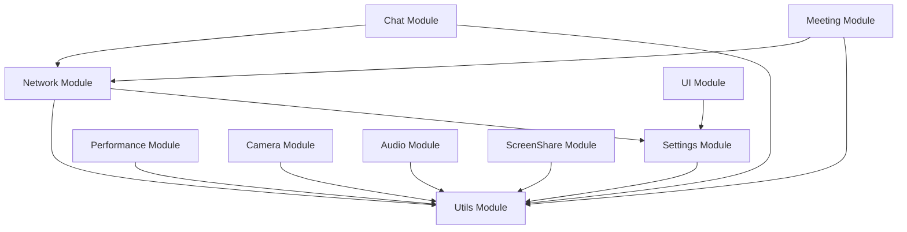

# Jitsi Meet Qt 模块化架构构建系统

## 概述

本构建系统为 Jitsi Meet Qt 项目提供了完整的模块化架构支持，包括模块管理、依赖检查、版本控制和条件编译功能。

## 架构特性

### 🏗️ 模块化构建系统
- **智能模块加载**: 自动检测和加载可用模块
- **依赖管理**: 自动验证模块间依赖关系
- **版本控制**: 支持模块版本兼容性检查
- **条件编译**: 支持模块的启用/禁用控制

### 📦 支持的模块

| 模块名称 | 描述 | 状态 | 依赖关系 |
|---------|------|------|----------|
| **Utils** | 通用工具和辅助函数 | ✅ 可用 | 无 |
| **Settings** | 应用设置和偏好管理 | ✅ 可用 | Utils |
| **Performance** | 性能监控和优化 | ✅ 可用 | Utils |
| **Camera** | 相机设备管理 | ✅ 已存在 | Utils |
| **Audio** | 音频设备管理 | 🔄 待创建 | Utils |
| **Network** | 网络通信管理 | 🔄 待创建 | Utils, Settings |
| **UI** | 用户界面管理 | 🔄 待创建 | Settings |
| **Chat** | 聊天消息处理 | 🔄 待创建 | Network, Utils |
| **ScreenShare** | 屏幕共享功能 | 🔄 待创建 | Utils |
| **Meeting** | 会议管理和链接处理 | 🔄 待创建 | Network, Utils |

## 使用方法

### 基本使用

在主项目文件中包含模块系统：

```qmake
# 包含模块系统
include(modules/modules.pri)
```

### 模块控制

#### 禁用特定模块

通过环境变量禁用模块：

```bash
# 禁用音频模块
export DISABLE_MODULE_AUDIO=1

# 禁用多个模块
export DISABLE_MODULE_AUDIO=1
export DISABLE_MODULE_CHAT=1
```

#### 编译时配置

在 qmake 命令行中配置：

```bash
# 禁用版本检查
qmake CONFIG-=module_version_check

# 禁用依赖检查
qmake CONFIG-=module_dependency_check
```

### 创建新模块

#### 1. 使用模板创建

```bash
# 复制模板文件
cp modules/module_template.pri modules/newmodule/newmodule.pri

# 编辑模板文件，替换占位符
# MODULE_NAME -> NEWMODULE
# module_name -> newmodule
# ModuleName -> NewModule
```

#### 2. 模块目录结构

```
modules/newmodule/
├── newmodule.pri           # 模块配置文件
├── README.md               # 模块文档
├── include/                # 核心头文件
│   ├── NewModuleModule.h
│   ├── NewModuleManager.h
│   └── NewModuleFactory.h
├── src/                    # 核心实现
├── interfaces/             # 接口定义
├── config/                 # 配置管理
├── utils/                  # 工具类
├── widgets/                # UI组件
├── tests/                  # 测试框架
├── examples/               # 示例代码
└── resources/              # 资源文件
```

#### 3. 更新模块系统

在 `modules.pri` 中添加新模块：

```qmake
# 新模块
$$isModuleEnabled(newmodule) {
    exists($PWD/newmodule/newmodule.pri) {
        include($PWD/newmodule/newmodule.pri)
        message("✓ NewModule module loaded")
        DEFINES += NEWMODULE_MODULE_AVAILABLE
        CONFIG += newmodule_module_loaded
    } else {
        message("○ NewModule module not found - will be created")
    }
}
```

## 配置选项

### 模块系统配置

| 配置项 | 描述 | 默认值 |
|--------|------|--------|
| `modules_enabled` | 启用模块系统 | true |
| `module_dependency_check` | 启用依赖检查 | true |
| `module_version_check` | 启用版本检查 | true |

### 模块特定配置

每个模块都支持以下配置选项：

```qmake
# 模块启用/禁用
CONFIG += module_name_enabled

# 模块特定功能
CONFIG += module_name_feature1
CONFIG += module_name_feature2
```

## 版本管理

### 版本兼容性

模块系统支持语义化版本控制：

- **主版本号**: 不兼容的API变更
- **次版本号**: 向后兼容的功能添加
- **修订版本号**: 向后兼容的问题修复

### 版本检查

系统会自动检查：

1. **模块版本兼容性**: 确保模块版本满足最低要求
2. **依赖关系**: 验证所需依赖模块已加载
3. **API兼容性**: 检查接口版本匹配

## 依赖管理

### 依赖关系图



### 依赖解析

系统会自动：

1. **检查依赖**: 验证所需模块已加载
2. **警告缺失**: 提示缺失的依赖模块
3. **建议顺序**: 推荐模块加载顺序

## 平台支持

### 跨平台兼容性

所有模块都支持以下平台：

- **Windows**: 完整支持，包括特定API
- **Linux**: 完整支持，使用标准Linux API
- **macOS**: 完整支持，使用Cocoa框架

### 平台特定配置

每个模块的 `.pri` 文件都包含平台特定配置：

```qmake
# Windows 特定
win32 {
    LIBS += -lwinmm
    DEFINES += MODULE_WINDOWS
}

# Linux 特定
unix:!macx {
    LIBS += -lpulse
    DEFINES += MODULE_LINUX
}

# macOS 特定
macx {
    LIBS += -framework CoreAudio
    DEFINES += MODULE_MACOS
}
```

## 调试和诊断

### 构建日志

模块系统提供详细的构建日志：

```
=== Jitsi Meet Qt Modular Architecture v2.0.0 ===
Loading modules with dependency management and version control...
✓ Utils module loaded
✓ Settings module loaded
✓ Performance module loaded
✓ Camera module loaded
○ Audio module not found - will be created
=== Module Loading Summary ===
Loaded modules: 4/10
=== Module Version Validation ===
✓ Camera module v1.2.0 (required: v1.2.0)
✓ Utils module v1.0.0 (required: v1.0.0)
=== Version Validation Complete ===
Modular architecture initialized successfully
```

### 常见问题

#### 模块加载失败

```
✗ Camera module not found
```

**解决方案**: 检查模块目录和 `.pri` 文件是否存在

#### 依赖关系警告

```
warning: Audio module requires Utils module
```

**解决方案**: 确保依赖模块已正确加载

#### 版本不兼容

```
✗ Audio module v0.9.0 incompatible (required: v1.0.0)
```

**解决方案**: 更新模块到兼容版本

## 最佳实践

### 模块开发

1. **遵循命名约定**: 使用一致的命名模式
2. **实现标准接口**: 继承基础接口类
3. **提供完整文档**: 包含README和API文档
4. **编写单元测试**: 确保模块质量
5. **版本语义化**: 遵循语义化版本控制

### 性能优化

1. **按需加载**: 只加载必要的模块
2. **延迟初始化**: 推迟模块初始化到使用时
3. **资源共享**: 在模块间共享公共资源
4. **缓存机制**: 实现适当的缓存策略

### 安全考虑

1. **输入验证**: 验证所有外部输入
2. **权限检查**: 实现适当的权限控制
3. **错误处理**: 优雅处理错误情况
4. **资源清理**: 确保资源正确释放

## 贡献指南

### 添加新模块

1. 创建模块目录结构
2. 实现核心功能和接口
3. 编写测试用例
4. 更新文档
5. 提交代码审查

### 修改现有模块

1. 保持向后兼容性
2. 更新版本号
3. 更新文档
4. 运行所有测试
5. 验证依赖关系

## 许可证

本模块系统遵循与主项目相同的许可证条款。# Jitsi Meet Qt 模块化重构版本发布说明

## 版本 2.0.0 - 模块化架构重构版本

**发布日期:** 2025年1月

### 🎯 重大更新

这是 Jitsi Meet Qt 的重大版本更新，完成了从单体架构到模块化架构的全面重构。基于现有相机模块的成功架构模式，我们将所有核心功能进行了模块化改造。

### ✨ 新功能特性

#### 🏗️ 模块化架构
- **统一的模块化设计**: 所有模块遵循相同的分层架构设计
- **标准化接口**: 每个模块都提供标准化的接口定义
- **模块管理系统**: 统一的模块加载、配置和管理机制
- **依赖关系管理**: 自动处理模块间的依赖关系

#### 🎵 音频模块 (Audio Module)
- **设备管理**: 独立的音频设备枚举和选择
- **音质控制**: 多级音质预设和实时调整
- **音量控制**: 精确的音量和静音控制
- **配置管理**: 完整的音频配置持久化

#### 🌐 网络模块 (Network Module)
- **协议支持**: WebRTC、HTTP、WebSocket协议处理
- **连接管理**: 自动重连和连接质量监控
- **网络诊断**: 实时网络质量分析和优化建议
- **配置灵活**: 服务器配置和连接参数管理

#### 🎨 界面UI模块 (UI Module)
- **主题系统**: 支持多主题切换和自定义样式
- **布局管理**: 响应式布局和窗口状态管理
- **组件库**: 可重用的UI组件库
- **界面配置**: 界面偏好设置和布局保存

#### ⚡ 性能模块 (Performance Module)
- **实时监控**: CPU、内存、网络性能监控
- **性能优化**: 启动优化、内存优化、渲染优化
- **指标收集**: 详细的性能指标收集和分析
- **性能报告**: 可视化性能报告和优化建议

#### 🛠️ 工具模块 (Utils Module)
- **日志系统**: 多级日志记录和管理
- **文件处理**: 配置文件、临时文件、文件监控
- **加密工具**: AES、RSA加密和哈希工具
- **字符串处理**: 字符串工具和验证器

#### ⚙️ 设置模块 (Settings Module)
- **存储后端**: 本地存储、云端同步、注册表存储
- **配置验证**: 设置验证和默认值管理
- **偏好管理**: 用户偏好设置和配置编辑
- **同步机制**: 跨设备设置同步

#### 💬 聊天模块 (Chat Module)
- **消息处理**: 文本消息、表情符号、文件分享
- **历史管理**: 消息存储、搜索和历史记录
- **聊天界面**: 现代化的聊天UI组件
- **消息配置**: 消息过滤和通知设置

#### 🖥️ 屏幕共享模块 (ScreenShare Module)
- **多种捕获**: 全屏、窗口、区域捕获
- **编码优化**: 高效的视频编码和帧处理
- **质量控制**: 捕获质量自适应和性能优化
- **预览功能**: 实时捕获预览和屏幕选择

#### 🤝 会议链接模块 (Meeting Module)
- **链接处理**: 会议链接解析、验证和跳转
- **会议管理**: 会议创建、加入和离开功能
- **认证系统**: 会议认证和权限管理
- **会议界面**: 直观的会议管理界面

### 🔧 技术改进

#### 架构优化
- **分层设计**: 清晰的分层架构，便于维护和扩展
- **接口标准化**: 统一的接口设计模式
- **依赖注入**: 松耦合的模块设计
- **错误处理**: 统一的错误处理和恢复机制

#### 性能提升
- **启动优化**: 模块化加载，减少启动时间
- **内存优化**: 按需加载，降低内存占用
- **通信优化**: 高效的模块间通信机制
- **资源管理**: 智能的资源分配和回收

#### 测试覆盖
- **单元测试**: 每个模块都有完整的单元测试
- **集成测试**: 模块间集成测试和兼容性测试
- **性能测试**: 性能基准测试和压力测试
- **自动化测试**: 持续集成和自动化测试流程

### 🛡️ 安全性增强

- **渐进式重构**: 安全的代码替换策略
- **兼容性保证**: 向后兼容性适配器
- **回滚机制**: 完整的回滚和恢复机制
- **功能验证**: 全面的功能验证和测试

### 📦 构建系统改进

- **条件编译**: 支持模块的条件编译
- **动态加载**: 运行时模块动态加载
- **打包优化**: 模块化打包和分发
- **版本管理**: 模块版本管理和兼容性检查

### 🔄 兼容性

#### 向后兼容
- **API兼容**: 保持现有API的兼容性
- **配置兼容**: 现有配置文件自动迁移
- **功能兼容**: 所有原有功能正常工作

#### 平台支持
- **Windows**: 完全支持 Windows 10/11
- **Linux**: 支持主流 Linux 发行版
- **macOS**: 支持 macOS 10.15+


