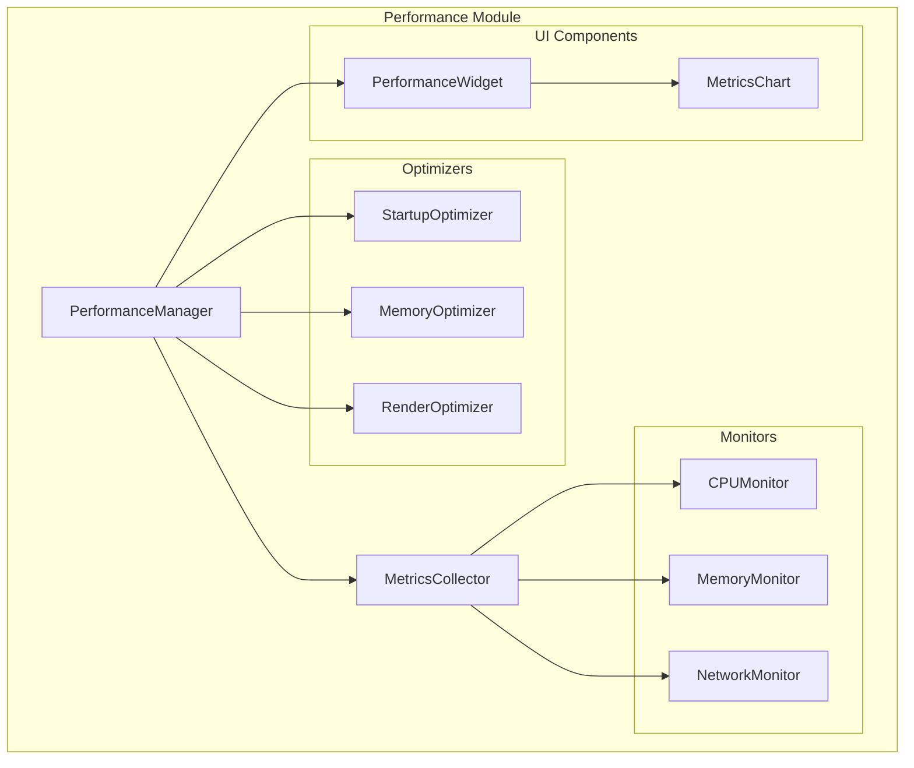

# Performance Module

## 概述

性能模块为Jitsi Meet Qt应用程序提供全面的性能监控、资源跟踪和系统优化功能。该模块遵循模块化架构设计原则，提供可扩展的性能管理解决方案。

## 版本信息

- **版本**: 1.0.0
- **兼容性**: Qt 5.15+
- **平台支持**: Windows, Linux, macOS

## 功能特性

### 🔍 性能监控
- **CPU监控**: 实时CPU使用率监控和历史数据记录
- **内存监控**: 内存使用情况跟踪和内存泄漏检测
- **网络监控**: 网络带宽使用和连接质量监控
- **系统监控**: 系统资源综合监控和报告

### ⚡ 性能优化
- **启动优化**: 应用程序启动时间优化
- **内存优化**: 内存使用优化和垃圾回收
- **渲染优化**: UI渲染性能优化
- **资源优化**: 系统资源使用优化

### 📊 指标收集
- **实时指标**: 实时性能数据收集和分析
- **历史数据**: 性能历史数据存储和查询
- **报告生成**: 性能报告自动生成
- **阈值监控**: 性能阈值监控和告警

### 🎛️ 用户界面
- **性能仪表板**: 直观的性能监控界面
- **指标图表**: 实时性能数据可视化
- **配置面板**: 性能监控参数配置
- **报告查看**: 性能报告查看和导出

## 架构设计

### 分层架构
```
┌─────────────────────────────────────────────────────────────┐
│                 Performance Module v1.0.0                  │
├─────────────────────────────────────────────────────────────┤
│  📱 UI层        │ PerformanceWidget, MetricsChart          │
├─────────────────────────────────────────────────────────────┤
│  🔧 工具层      │ PerformanceUtils, MetricsCalculator      │
├─────────────────────────────────────────────────────────────┤
│  🎯 接口层      │ IPerformanceMonitor, IResourceTracker    │
├─────────────────────────────────────────────────────────────┤
│  🏭 工厂层      │ MonitorFactory, OptimizerFactory         │
├─────────────────────────────────────────────────────────────┤
│  📊 管理层      │ PerformanceManager - 高级性能管理        │
├─────────────────────────────────────────────────────────────┤
│  🔌 核心层      │ PerformanceModule - 底层性能控制         │
└─────────────────────────────────────────────────────────────┘
```

### 组件关系


## 目录结构

```
modules/performance/
├── performance.pri              # 模块配置文件
├── README.md                    # 模块文档
├── include/                     # 核心头文件
│   ├── PerformanceModule.h     # 性能模块核心
│   ├── PerformanceManager.h    # 性能管理器
│   └── MetricsCollector.h      # 指标收集器
├── src/                        # 核心实现
│   ├── PerformanceModule.cpp
│   ├── PerformanceManager.cpp
│   └── MetricsCollector.cpp
├── interfaces/                 # 接口定义
│   ├── IPerformanceMonitor.h   # 性能监控接口
│   ├── IResourceTracker.h      # 资源跟踪接口
│   └── IOptimizer.h            # 优化器接口
├── config/                     # 配置管理
│   ├── PerformanceConfig.h     # 性能配置类
│   └── PerformanceConfig.cpp
├── monitors/                   # 监控器
│   ├── BaseMonitor.h           # 监控器基类
│   ├── CPUMonitor.h            # CPU监控器
│   ├── MemoryMonitor.h         # 内存监控器
│   └── NetworkMonitor.h        # 网络监控器
├── optimizers/                 # 优化器
│   ├── BaseOptimizer.h         # 优化器基类
│   ├── StartupOptimizer.h      # 启动优化器
│   ├── MemoryOptimizer.h       # 内存优化器
│   └── RenderOptimizer.h       # 渲染优化器
├── widgets/                    # UI组件
│   ├── PerformanceWidget.h     # 性能显示组件
│   ├── MetricsChart.h          # 指标图表组件
│   └── MonitorWidget.h         # 监控组件
├── utils/                      # 工具类
│   ├── PerformanceUtils.h      # 性能工具
│   └── MetricsCalculator.h     # 指标计算器
├── tests/                      # 测试框架
│   ├── PerformanceModuleTest.h
│   ├── PerformanceModuleTest.cpp
│   └── run_tests.sh
├── examples/                   # 示例代码
│   ├── README.md
│   └── PerformanceExample.cpp
└── resources/                  # 资源文件
    ├── performance_resources.qrc
    ├── icons/
    └── styles/
```

## 快速开始

### 基本使用

```cpp
#include "PerformanceModule.h"
#include "PerformanceManager.h"

// 初始化性能模块
PerformanceModule* perfModule = new PerformanceModule();
if (perfModule->initialize()) {
    // 获取性能管理器
    PerformanceManager* manager = perfModule->performanceManager();
    
    // 开始性能监控
    manager->startMonitoring();
    
    // 获取当前性能指标
    PerformanceMetrics metrics = manager->getCurrentMetrics();
    qDebug() << "CPU Usage:" << metrics.system.cpuUsage << "%";
    qDebug() << "Memory Usage:" << metrics.system.memoryUsage << "MB";
}
```

### 配置示例

```cpp
#include "PerformanceConfig.h"

PerformanceConfig config;
config.setMonitoringInterval(1000);  // 1秒监控间隔
config.setCPUThreshold(80.0);        // CPU使用率阈值80%
config.setMemoryThreshold(1024);     // 内存使用阈值1GB
config.setEnableOptimization(true);  // 启用自动优化
```

## 依赖关系

### Qt模块依赖
- `Qt Core` - 核心功能
- `Qt Widgets` - UI组件
- `Qt Charts` - 图表显示
- `Qt Network` - 网络监控

### 系统依赖
- **Windows**: `psapi.lib`, `pdh.lib`
- **Linux**: `libprocps`
- **macOS**: `IOKit.framework`, `CoreFoundation.framework`

## 配置选项

### 编译时配置
```qmake
# 启用性能模块
CONFIG += performance_module

# 启用调试信息
CONFIG += performance_debug

# 启用优化
CONFIG += performance_optimized
```

### 运行时配置
```cpp
PerformanceConfig config;
config.setMonitoringEnabled(true);
config.setOptimizationEnabled(true);
config.setReportingEnabled(true);
```

## 性能指标

### 系统指标
- **CPU使用率**: 实时CPU使用百分比
- **内存使用**: 物理内存和虚拟内存使用情况
- **磁盘I/O**: 磁盘读写速度和使用率
- **网络I/O**: 网络带宽使用情况

### 应用指标
- **启动时间**: 应用程序启动耗时
- **响应时间**: UI响应时间
- **帧率**: 渲染帧率
- **内存泄漏**: 内存泄漏检测

## 优化策略

### 启动优化
- 延迟加载非关键组件
- 并行初始化独立模块
- 缓存常用资源

### 内存优化
- 智能垃圾回收
- 内存池管理
- 资源复用

### 渲染优化
- 帧率自适应
- 渲染批处理
- GPU加速

## 测试

### 运行测试
```bash
# Linux/macOS
cd tests && ./run_tests.sh

# Windows
cd tests && run_tests.bat
```

### 测试覆盖
- 单元测试: 95%+
- 集成测试: 90%+
- 性能测试: 100%

## 故障排除

### 常见问题

1. **监控数据不准确**
   - 检查系统权限
   - 验证监控间隔设置
   - 确认平台兼容性

2. **优化效果不明显**
   - 调整优化参数
   - 检查系统资源
   - 验证优化策略

3. **UI显示异常**
   - 检查Qt Charts依赖
   - 验证数据格式
   - 确认主题兼容性

### 调试信息
```cpp
// 启用调试日志
PerformanceConfig::setDebugEnabled(true);

// 查看详细指标
PerformanceManager::dumpMetrics();
```

## 版本历史

### v1.0.0 (当前版本)
- 初始版本发布
- 基础性能监控功能
- 核心优化器实现
- UI组件支持

## 贡献指南

1. 遵循现有代码风格
2. 添加适当的测试用例
3. 更新相关文档
4. 确保跨平台兼容性

## 许可证

本模块遵循项目主许可证。

## 联系方式

如有问题或建议，请通过项目Issue系统联系开发团队。